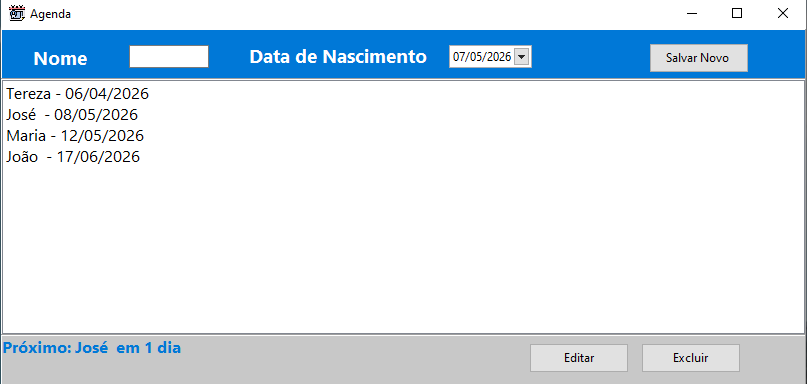
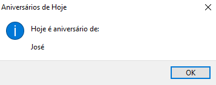

# 🎂 Agenda de Aniversários
Aplicação desktop desenvolvida em Object Pascal utilizando Lazarus + SQLite para gerenciamento de aniversários.
O sistema permite cadastrar, editar, excluir e visualizar aniversários, além de destacar automaticamente o próximo aniversário da lista e exibir notificações de aniversariantes do dia.

# 📸 Preview
## Tela Principal
<div align="center">
  
  
</div>

# 🚀 Como Executar
## Pré-requisitos
- Windows
- Lazarus instalado (caso queira compilar)
## Como Instalar?
instalar através do instalador disponível na pasta, basta baixar:
```text
 🗂️Instalador/Instalar Agenda de Aniversários.exe
```

🛠️ Tecnologias Utilizadas
- **Lazarus**
- **Free Pascal**
- **SQLite**
- **Object Pascal**

# ✨ Funcionalidades
- ✅ Cadastro de aniversários
- ✅ Edição de registros
- ✅ Exclusão com confirmação
- ✅ Persistência de dados com SQLite
- ✅ Ordenação automática por próximo aniversário
- ✅ Destaque do próximo aniversariante
- ✅ Popup automático para aniversários do dia
- ✅ Banco criado automaticamente no primeiro uso
- ✅ Dados salvos localmente para cada usuário
- ✅ Interface simples e intuitiva

# ❤️ Dedicatória
Dedico esse software à minha noiva **Nayara de Souza Oliveira**,
que sempre dizia:

> "Amor, você nunca lembra as datas de aniversário kk"

Então resolvi fazer o que todo desenvolvedor faz:
transformar um problema do cotidiano em software. 😄
